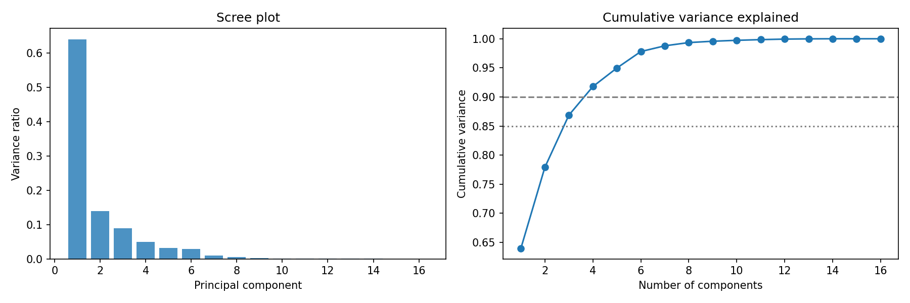
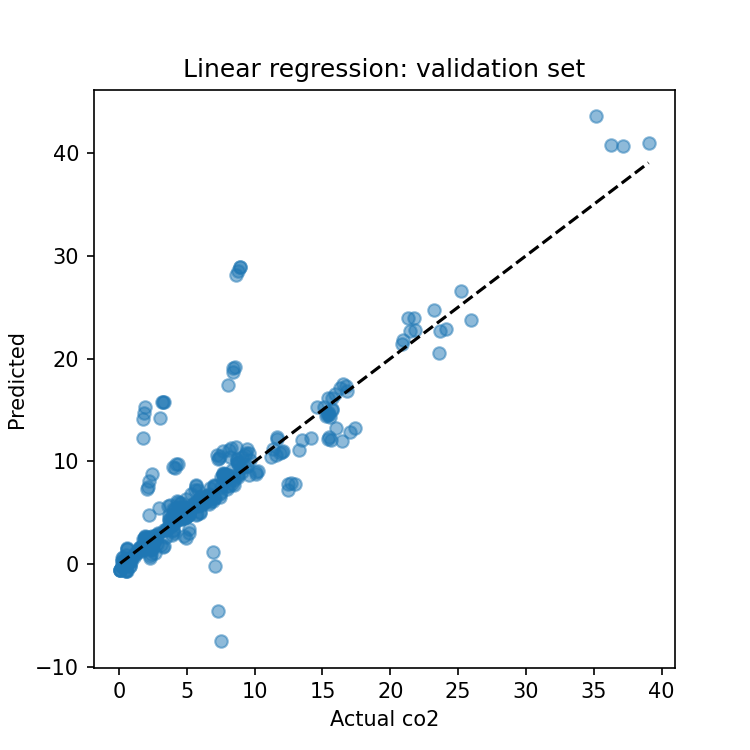
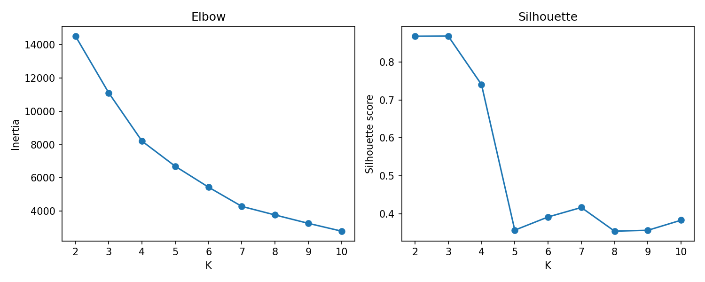
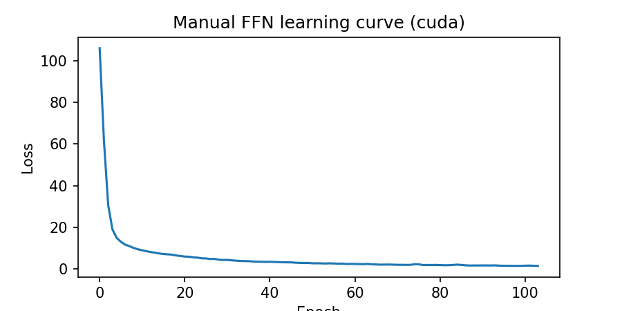
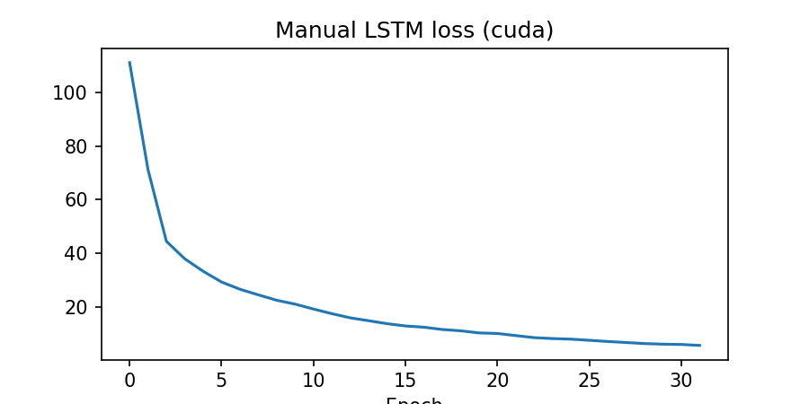
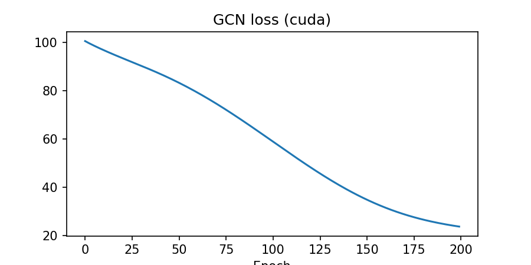
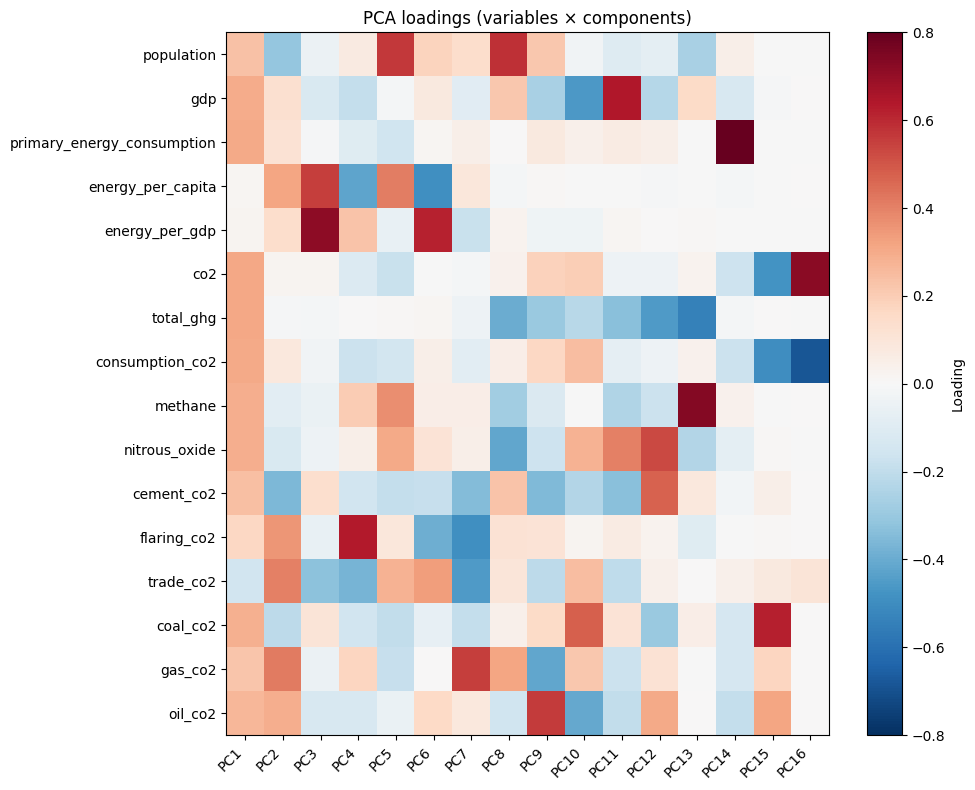
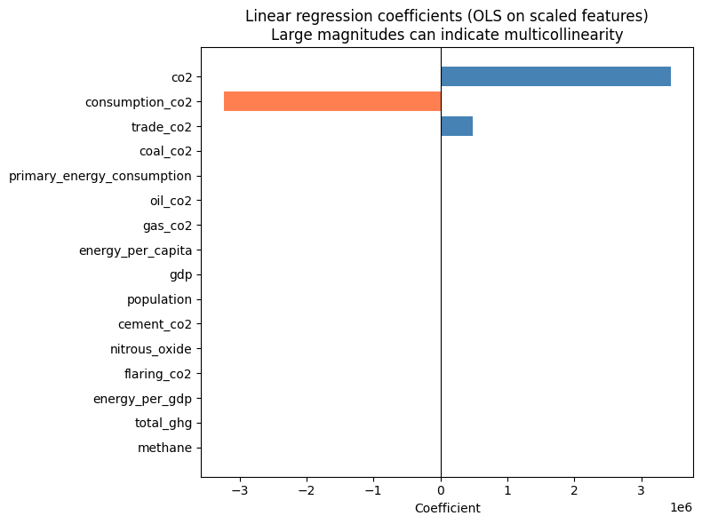
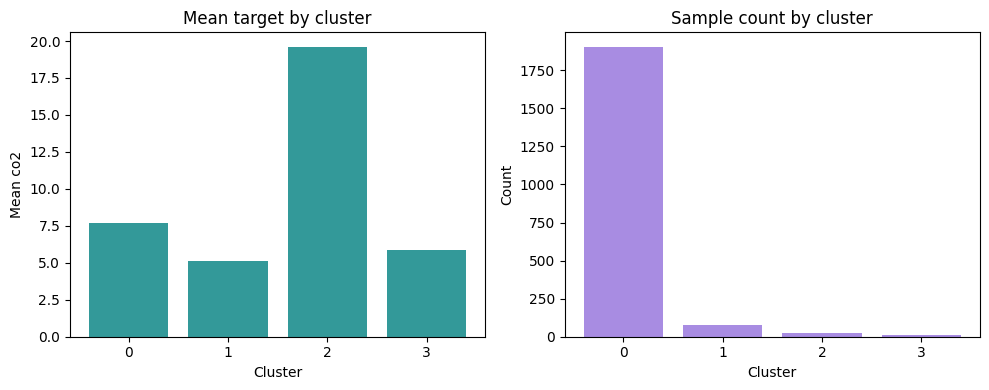
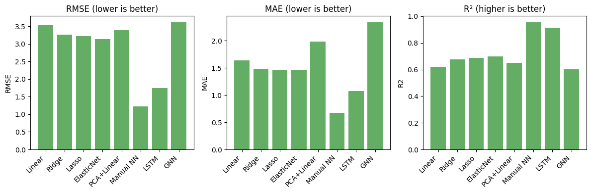

# Global CO2 Emissions Modeling

Statistical analysis and modeling of global CO₂ and greenhouse gas emissions using economic and energy indicators. The project includes data cleaning, exploratory analysis, PCA, linear and regularized regression, clustering, and neural models (feedforward NN, LSTM, GNN) implemented in a single Jupyter notebook.

---

## Data

- **Source:** Our World in Data CO₂/GHG emissions (see [dataset.md](dataset.md)).
- **Cleaning:** [data_clean.Rmd](data_clean.Rmd) — years ≥ 1990, valid `iso_code`, 20 variables, complete cases only.
- **File:** [cleaned_co2_data_20vars.csv](cleaned_co2_data_20vars.csv) — ~2,640 country-year rows, 20 columns.
- **Variables:** 3 IDs (`country`, `year`, `iso_code`); 17 numeric (economics, energy, emissions). **Target:** `co2` (total CO₂ emissions).
- **Predictors (15 columns):** `population`, `gdp`, `primary_energy_consumption`, `energy_per_capita`, `energy_per_gdp`, `total_ghg`, `consumption_co2`, `methane`, `nitrous_oxide`, `cement_co2`, `flaring_co2`, `trade_co2`, `coal_co2`, `gas_co2`, `oil_co2`. We do **not** use `co2` or `co2_per_capita` as predictors (co2_per_capita = co2/population would leak into predicting co2). All models predict **co2** from these 15 features.

---

## Setup

```bash
pip install -r requirements.txt
```

For **RTX 50 series (Blackwell/sm_120)** GPU support, install PyTorch with CUDA 12.8:

```bash
pip install --upgrade torch torchvision torchaudio --index-url https://download.pytorch.org/whl/cu128
```

The notebook uses CUDA when available and compatible; otherwise it falls back to CPU.

---

## Pipeline (from [plan.md](plan.md))

All steps are implemented in **[co2_modeling.ipynb](co2_modeling.ipynb)**.

### 1. Load data, splits, scaling

- **Splits (time-based):** Train 1990–2015 (2,017 rows), validation 2016–2019 (354), test 2020–2022 (269).
- **Scaling:** `StandardScaler` fit on train; applied to val/test. Predictors only (target unscaled for regression).
- **Helpers:** `evaluate(y_true, y_pred)` → RMSE, MAE, R² (handles empty arrays); `metrics_str(d)` for readable metric strings.

### 2. PCA

- PCA fit on training predictors; scree plot and cumulative variance.
- **Outputs:** Components for 85% and 90% variance; scree plot saved to `output/figures/pca_scree.png`; loadings table to `output/tables/pca_loadings.csv`.
- Train/val/test projected to PCA scores for downstream use (e.g. PCA+Linear, clustering).

### 3. Regression

- **Linear regression** — OLS on all predictors; coefficients and residual plot.
- **Ridge, Lasso, Elastic Net** — regularized fits; validation used for model selection.
- **PCA + Linear** — linear regression on PCA scores (same number of components as chosen for variance).
- **Outputs:** Coefficient table (`output/tables/linear_coefficients.csv`), residual plot (`output/figures/regression_residuals.png`), and validation/test metrics for each model.

**Note on linear coefficients:** The saved coefficients are from **OLS on scaled original predictors** (not from PCA). Only a few predictors (e.g. `co2`, `consumption_co2`, `trade_co2`) appear to have large coefficients; the rest sit near zero. This is a typical **multicollinearity** effect: when predictors are highly correlated (e.g. `co2` and `consumption_co2`), OLS can assign large opposite coefficients that partly cancel, so a few variables dominate the scale. For interpretability of relative importance, standardized coefficients or regularized models (Ridge/Lasso) are preferred; the table correctly reflects the fitted OLS model.

### 4. Clustering

- **K-means** on PCA scores (train fit); number of clusters chosen by elbow and/or silhouette.
- Train/val/test assigned to clusters; summary of mean target and count per cluster.
- **Outputs:** `output/figures/clustering_elbow_silhouette.png`, `output/tables/cluster_summary.csv`.

### 5. Feedforward neural network (Manual FFN)

- **Manual implementation** (no high-level NN libs): 2 hidden layers (128, 64), ReLU, MSE loss, Adam optimizer. Config in class; GPU used when available.
- **Config:** `hidden_sizes=(128, 64)`, `max_epochs=500`, `patience=15`, `lr=1e-3`, `batch_size=64`.
- **Early stopping:** Validation RMSE; best parameters restored after training.
- **Outputs:** Validation and test metrics (RMSE, MAE, R²), learning curve plot `output/figures/nn_learning_curve.png`.

### 6. LSTM (panel time-series)

- **Manual LSTM** (custom cell, no Keras): per-country sequences `(X_{t-4}, …, X_t)` → `y_t`; sequence length 5. Train on 1990–2019; if test has no sequences (2020+ too short), holdout 2014–2019 for LSTM test and train on 1990–2013.
- **Config:** `n_in=16`, `hidden_size=64`, `max_epochs=200`, `patience=3`, `lr=1e-3`, `batch_size=32`.
- **Early stopping:** Validation RMSE (or train loss when no val); best model restored.
- **Outputs:** Test metrics when test sequences exist; learning curve `output/figures/lstm_learning_curve.png`.

### 7. GNN (graph neural network)

- **Graph:** Nodes = countries; edges from correlation of country-level predictor means (threshold 0.5). Adjacency row-normalized: `A_norm = D^{-1} A`.
- **Manual GCN:** 2-layer message passing + **skip connection**: `out = (A_norm @ H @ W2) + (X @ W_skip)`. ReLU on hidden layer; country-level predictions then mapped to test set by country.
- **Config:** `n_feat=16`, `hidden_size=32`, `max_epochs=200`, `patience=15`, `lr=0.01`.
- **Early stopping:** Training loss; no separate validation set for GCN.
- **Outputs:** Country-level R²; test metrics via country mapping; `output/figures/gnn_learning_curve.png`.

---

## Outputs

### Figures (from notebook)

| Description |
|-------------|
| **PCA scree and cumulative variance** |
|  |
| **Regression residuals** |
|  |
| **K-means elbow and silhouette** |
|  |
| **FFN training loss** |
|  |
| **LSTM training loss** |
|  |
| **GCN training loss** |
|  |

### CSV-derived visualizations

The notebook generates these PNGs at the end (section “CSV-derived visualizations”) from the saved tables; no separate script is needed.

| Description |
|-------------|
| **PCA loadings heatmap** (variables × components) |
|  |
| **Linear regression coefficients** |
|  |
| **Cluster summary** (mean target and count by cluster) |
|  |
| **Model comparison** (RMSE, MAE, R² on test) |
|  |

### Output file reference

| Path | Description |
|------|-------------|
| `output/figures/pca_scree.png` | PCA scree and cumulative variance |
| `output/figures/regression_residuals.png` | Regression residuals |
| `output/figures/clustering_elbow_silhouette.png` | K-means elbow and silhouette |
| `output/figures/nn_learning_curve.png` | FFN training loss |
| `output/figures/lstm_learning_curve.png` | LSTM training loss |
| `output/figures/gnn_learning_curve.png` | GCN training loss |
| `output/figures/pca_loadings_heatmap.png` | PCA loadings heatmap (from CSV) |
| `output/figures/linear_coefficients.png` | OLS coefficients on scaled features (from CSV; see multicollinearity note in §3) |
| `output/figures/cluster_summary.png` | Cluster mean & count (from CSV) |
| `output/figures/model_comparison.png` | Model metrics comparison (from CSV) |
| `output/tables/pca_loadings.csv` | PCA loadings |
| `output/tables/linear_coefficients.csv` | Linear regression coefficients |
| `output/tables/cluster_summary.csv` | Cluster mean target and counts |
| `output/tables/model_comparison.csv` | RMSE, MAE, R² for all models on test |

---

## Model comparison

Models compared on the **test set** (2020–2022, or LSTM holdout when applicable): Linear, Ridge, Lasso, ElasticNet, PCA+Linear, Manual NN, LSTM (if test sequences exist), GNN.

- **Metrics:** RMSE, MAE, R². Best by R² and best by RMSE are printed.
- **Typical result:** Manual NN achieves best R² and lowest RMSE (e.g. R² ≈ 0.95, RMSE ≈ 1.23); LSTM is close when evaluated on sequences; GNN is weaker (country-level graph + skip helps but test mapping is coarse).

---

## Summary

- **Data:** Cleaned country-year panel, 15 predictors, target `co2`.
- **Splits:** Time-based train/val/test; scaling and evaluation helpers.
- **Models:** Linear, Ridge, Lasso, ElasticNet, PCA+Linear, manual FFN (with early stopping), manual LSTM (with early stopping), manual GCN with skip connection (with early stopping).
- **Outputs:** Figures and tables under `output/`; final comparison table and best-model summary in the notebook.

For full implementation details and plan, see [plan.md](plan.md) and [co2_modeling.ipynb](co2_modeling.ipynb).
