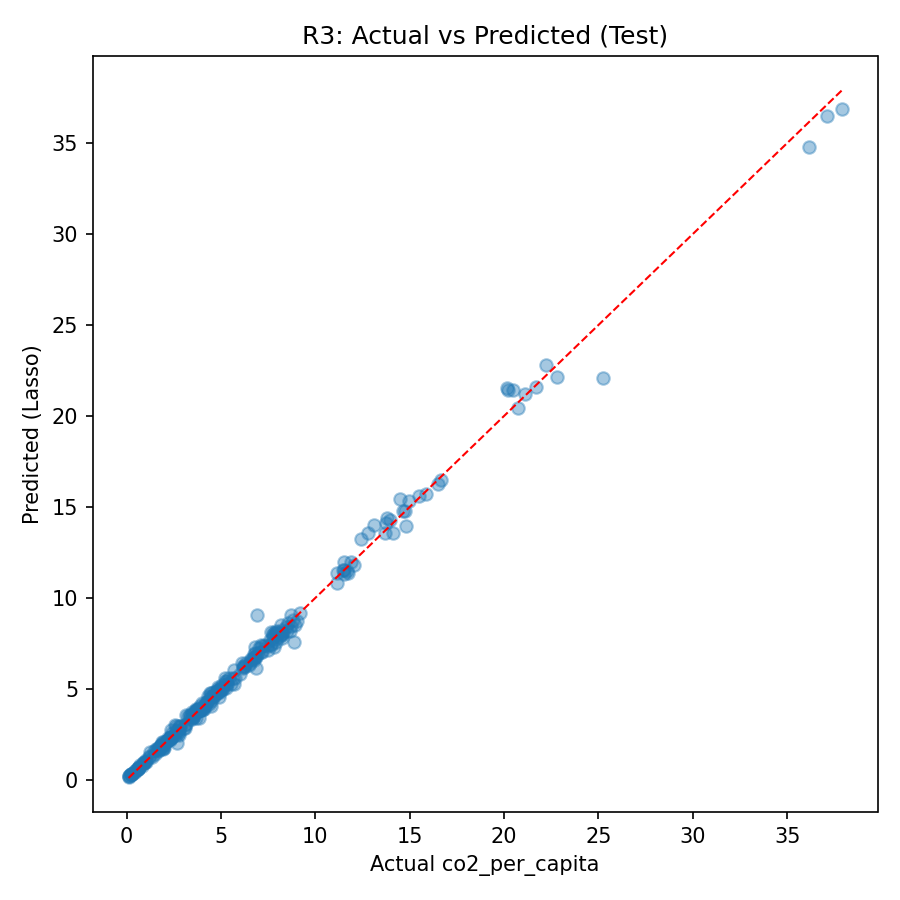

# Global CO₂ Emissions Analysis — AMS 597 Group 9

Statistical and machine learning analysis of global CO₂ emissions using economic, demographic,
and energy indicators across a multi-country, multi-year panel dataset.

The project addresses three research questions (R1–R3), implemented across two reproducible files:
an R Markdown report (`R1-R2_AMS-597-Project.Rmd`) and a Python Jupyter notebook (`r3_forecasting.ipynb`).

---

## Research Questions

| RQ | Question | Method | File |
|----|----------|--------|------|
| **R1** | Which economic and energy-related variables are most strongly associated with CO₂ emissions per capita? | OLS, Ridge, Lasso | `R1-R2_AMS-597-Project.Rmd` |
| **R2** | Can country-year observations be grouped into meaningful emission clusters? | K-Means, Hierarchical, DBSCAN, GMM | `R1-R2_AMS-597-Project.Rmd` |
| **R3** | Can future CO₂ emissions be accurately forecast, and do deep learning models outperform classical baselines? | Linear, Ridge, Lasso, RF, XGBoost, MLP, LSTM, PatchTST, TimesFM, Ensemble | `r3_forecasting.ipynb` |

---

## Repository Structure

```
.
├── R1-R2_AMS-597-Project.Rmd     # R1 regression + R2 clustering (R)
├── r3_forecasting.ipynb          # R3 forecasting — all ML/DL models (Python)
├── co2_modeling.ipynb            # Exploratory modeling notebook (Python)
├── eda_co2.Rmd                   # Standalone EDA report (R)
├── cleaned_co2_data_20vars.csv   # Cleaned dataset (~2,640 country-year rows)
├── requirements.txt              # Python dependencies
├── figures/                      # R1/R2 output figures (from knitted Rmd)
├── output_r3/
│   ├── figures/                  # R3 model prediction and comparison plots
│   └── tables/                   # R3 metrics CSV files
├── output/figures/               # co2_modeling.ipynb output figures
├── Fix.md                        # Project planning notes
└── olds/                         # Archived earlier versions
```

---

## Data

- **Source:** [Our World in Data — CO₂ and Greenhouse Gas Emissions](https://github.com/owid/co2-data)
- **Cleaned file:** `cleaned_co2_data_20vars.csv` — years ≥ 1990, valid ISO codes, complete cases only
- **Dimensions:** ~2,640 country-year observations × 20 columns
- **Target (R1/R2):** `co2_per_capita` | **Target (R3):** `co2_per_capita`
- **Key predictors:** `gdp`, `population`, `energy_per_capita`, `total_ghg`, `coal_co2`, `oil_co2`, `gas_co2`, `methane`, and others

---

## Setup

### Python (R3)

```bash
pip install -r requirements.txt
```

For **RTX 50-series (Blackwell / sm_120)** GPU support:

```bash
pip install --upgrade torch torchvision torchaudio --index-url https://download.pytorch.org/whl/cu128
```

### R (R1/R2 + EDA)

```r
install.packages(c(
  "tidyverse", "glmnet", "caret", "factoextra", "cluster",
  "corrplot", "car", "knitr", "dbscan", "mclust", "gridExtra"
))
```

```bash
Rscript -e "rmarkdown::render('R1-R2_AMS-597-Project.Rmd')"
```

---

## R1 — Regression Analysis

**Research Question:** *Which economic and energy-related variables are most strongly associated with CO₂ emissions per capita?*

**Variables:** `co2_per_capita` ~ `gdp` + `population` + `energy_per_capita` | **Split:** 80/20 train-test

### Correlation Matrix


### Model Comparison (RMSE / R² / MAE)


### Actual vs Predicted — OLS, Ridge, Lasso


### OLS Residual Diagnostics


### Key Finding

`energy_per_capita` is the dominant predictor across all three models (R² > 0.85). Lasso confirms
this through variable selection — GDP has a secondary positive effect while population is
non-significant after controlling for energy use.

---

## R2 — Clustering Analysis

**Research Question:** *Can country-year observations be grouped into meaningful emission clusters?*

**Features:** `co2_per_capita`, `total_ghg`, `methane`, `coal_co2`, `oil_co2`, `gas_co2` | **Unit:** Country-year observations

### EDA: GDP vs CO₂


### PCA Scree Plot


### Optimal K — Elbow and Silhouette


### K-Means Clustering (k = 3)


### Hierarchical Clustering — Dendrogram


### DBSCAN Clustering


### GMM — Gaussian Mixture Model


### All Methods Side-by-Side


### Silhouette Comparison: K-Means vs GMM


### Key Finding

K-Means, Hierarchical, and GMM converge on three coherent emission profiles (Low / Medium / High)
with high Adjusted Rand Index (~0.7–0.9), confirming robustness across methods.
DBSCAN uniquely identifies anomalous country-year outliers that resist clean classification.

---

## R3 — Forecasting Analysis

**Research Question:** *Can future CO₂ emissions be accurately forecast, and do deep learning models outperform classical baselines?*

**Target:** `co2_per_capita` | **Split:** Time-based (train ≤ 2015, val 2016–2019, test 2020+)

**Feature engineering:** Lag features (`co2_lag1`, `co2_lag3`, `gdp_lag1`, `energy_lag1`), rolling averages, year trend.

### Model Comparison (Test RMSE)


### Test Set Results

| Model | Test RMSE | Test MAE | Test R² |
|-------|-----------|----------|---------|
| **Lasso** | **0.376** | **0.207** | **0.9957** |
| Ensemble (Lasso+Linear) | 0.384 | 0.210 | 0.9956 |
| Linear | 0.406 | 0.224 | 0.9950 |
| Ridge | 0.408 | 0.213 | 0.9950 |
| XGBoost | 0.502 | 0.283 | 0.9924 |
| Random Forest | 0.553 | 0.299 | 0.9907 |
| MLP | 0.584 | 0.347 | 0.9897 |
| PatchTST | 0.901 | 0.529 | 0.9754 |
| TimesFM | 0.947 | 0.541 | 0.9728 |
| LSTM | 0.960 | 0.545 | 0.9723 |

### Best Model — Predicted vs Actual



### Linear Regression


### Lasso Regression


### Ridge Regression


### Random Forest


### XGBoost


### MLP — Learning Curve & Predictions


### LSTM — Learning Curve & Predictions


### PatchTST (Hugging Face) — Predictions & Yearly Forecast


### TimesFM (Hugging Face) — Predictions & Yearly Forecast


### Ensemble (Lasso + Linear)


### Key Finding

Lasso achieves the best test R² (0.9957) and lowest RMSE (0.376), outperforming all tree-based,
neural, and pretrained models on this dataset. The ensemble (Lasso + Linear) matches closely.
Pretrained Hugging Face models (PatchTST, TimesFM) deliver competitive zero-shot performance
(R² ≈ 0.975) without any task-specific training, demonstrating strong generalization from
large-scale pretraining.

---

## Authors

Group 9 — AMS 597 Statistical Computing, Spring 2026
